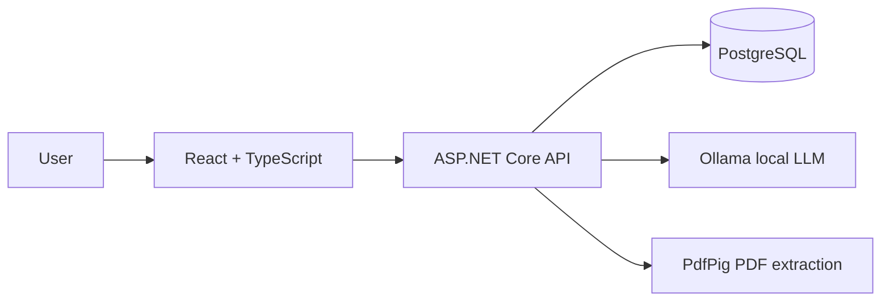
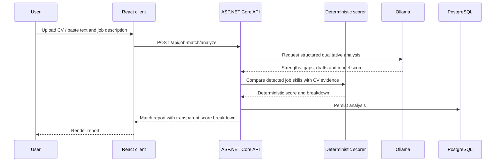

# ApplyWise Architecture

## System context

## Analysis flow

## Scoring responsibility

The LLM generates qualitative content such as summaries, recommendations and draft messages. The primary score is calculated separately by deterministic code from a maintained skill lexicon. This separation makes the displayed score reproducible and easier to test.

When the job description contains no supported skill from the current lexicon, the API explicitly marks the result as an LLM fallback instead of presenting the score as deterministic.

## Runtime topology

Docker Compose starts five containers:

- React frontend served by Nginx
- ASP.NET Core backend
- PostgreSQL
- Ollama server
- One-shot Ollama model puller

The backend waits for PostgreSQL health and successful model installation before starting.

## Current boundaries

- Authentication and per-user data isolation are not implemented yet.
- The local Ollama runtime makes the default setup privacy-friendly but unsuitable for a lightweight public hosted demo.
- Production deployment should use a hosted inference provider or a dedicated Ollama host and must add rate limiting, secrets management and user-level authorization.
